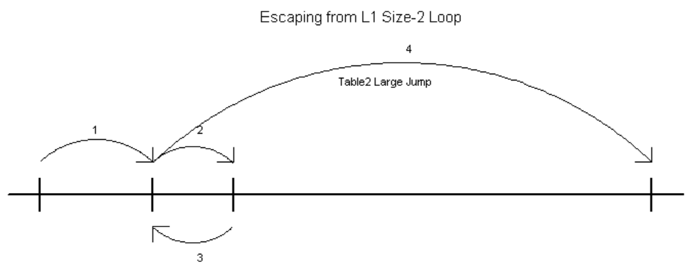
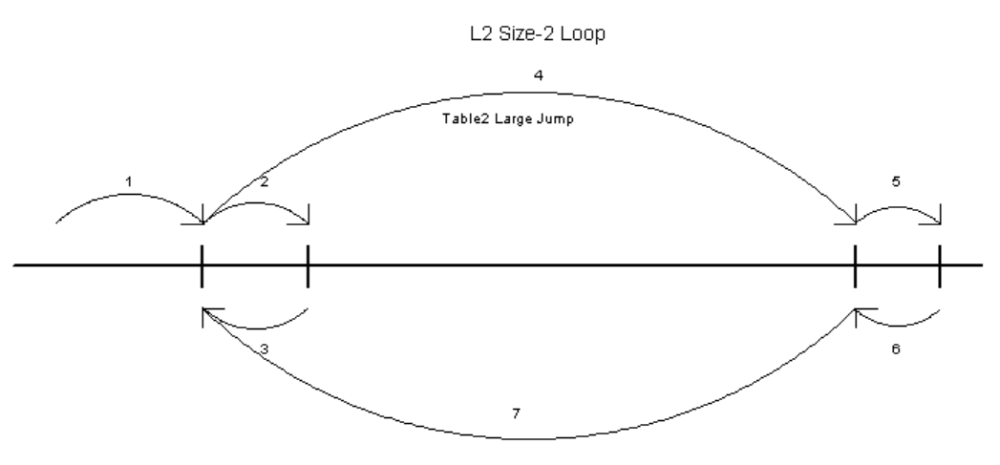

PART 2

Discussion thread: https://bitcointalk.org/index.php?topic=5517607

This software demonstrates a good way to handle looping during solving ECDLP using kangaroos by SOTA method and how to keep stable K=1.15 at any range.

Since a kangaroo can jump left and right, it loops every 2*JMP_CNT jumps (on average). 
There are two tasks to fix it:
- Detect looping.
- Escape from a loop.

Let's check two methods for loop handling.

1. Simple method.

This method is usually used in papers because it's straight and simple.
We just keep a short list with visited points, after every jump we add a new point to the list and also check if this point is already there.
If a loop is detected, we move kangaroo to a new place randomly.
This method is bad if 2^DP_BITS is much higher than number of jumps JMP_CNT because it breaks a chain of kangaroo jumps so another kangaroo won't be able to follow the chain. 
Database of DPs grows as normal, but every DP represents much less points than it must (2^DP_BITS).
Therefore K is bad though database looks good. 
Press "Simple loop handling" button and learn its code to see the details. 
You can compare Simple and Advanced methods for different options, for example, I get these results (for default 500 points, 512 kangaroos):

RANGE_BITS = 40, DP_BITS = 8: K for Simple: 1.36, K for Advanced: 1.23 (with DP overhead). 
RANGE_BITS = 48, DP_BITS = 10: K for Simple: 1.45, K for Advanced: 1.18 (with DP overhead). 
RANGE_BITS = 56, DP_BITS = 13: K for Simple: 2.60, K for Advanced: 1.16 (with DP overhead). 
RANGE_BITS = 60, DP_BITS = 15: K for Simple: skipped(no sense), K for Advanced: 1.16 (with DP overhead). 

2. Advanced method.

I cannot find any papers about this method so let's think that I invented it :)
This method does not break a chain of jumps so K is the same as it must be.

First of all, I created a method which can detect not only short loops but even very large loops (2^40 by default), learn code to see how it works. 
This method is not used in fast GPU implementation (because it's useless there), it's used only in this software to collect loop statistics. 
The idea is to keep several lists with visited points and move points with lowest distance value to the next list when previous list is full (they work as ring buffers). 
So the first list catches small loops up to MD_LEN size, next catches larger loops up to MD_LEN^2, etc.
Though this method is not ideal and has some minor issues, it catches loops of any size and useful to examine loops in details. 

There are two types of loops:
- small even-size symmetric loops: 2, 4, 6, etc. Frequency of these loops depends on JMP_CNT value only (they don't depend on range) and can be easily detected. 
  The most often loop has size 2, other sizes are very rare. 
- large loops that contains many different jumps with zero sum. Probability of these loops depends on DP_BITS (range) and they appear every some_loop_coeff * sqrt(range_of_jumps) jumps (on average).
I will show that large loops can be ignored completely in my method with two jump tables.

To exit from a small loop and don't break the chain of jumps we use the second table of jumps, these jumps are significantly larger than jumps in the main jump table, 
this way we greatly reduce probability of large loops. 
If another kangaroo will jump to some point of the chain, after some time it will jump to the same loop and will use the same large jump for exit, so the chain is solid.  
There is a small chance that another kangaroo will jump into the second point of the loop, in this case it will detect looping in different point and therefore 
use different large jump to exit, but this chance is low, on average we have only one such point for every 2*JMP_CNT points in the chain. 
There is a way to handle it: we can examine all points inside of the loop and use the point with minimal X value as the exit point. 
But in practice we can ignore this issue completely because it does not make K worse and this issue is not increased for high ranges and DP_BITS values and does not depend on path's length. 

There is also a looping issue with the second jump table - sometimes large jump immediately leads to another loop and after loop detection a kangaroo 
jumps back to the first loop, this second-level looping will happen every 8 * JMP_CNT^2 * JMP_CNT2 jumps (on average), this is Level2-looping with size 2. 
Size 4 and larger is possible too (exactly as for Level1 loops), but it's probability is almost zero so we can ignore it. 
It's a good idea to make the second table large to reduce L2 looping, but the issue still exists for long paths. 
To fix it, we can keep the start point for last large jump to detect L2 looping. If we return to this point after latest large jump, it means that L2 loop is detected. 
The best way is to use next large jump in the table in this case to break such L2 looping.
If another kangaroo will jump to some point of the chain, it will follow the same path so we still keep the chain solid, except one point (same small issue as for Level1 loops and we can ignore it too).

When large loops can be ignored?
It depends on the number of jumps for every kangaroo before the point is solved. 
If we have a small number of kangaroos (much less than sqrt(range)), they will jump about sqrt(range_of_jumps) times and will catch a loop much faster than the point is solved because range_of_jumps is about sqrt(range). 
The formula for the number of jumps to catch a large loop is the same as for the number of jumps to solve the point: some_loop_coeff * sqrt(range_of_jumps).
Second table with large jumps (jumps must be a bit smaller than main range) increases range_of_jumps greatly almost up to main range and it allows us to ignore large loops.

Here is how to confirm it:
- Uncomment "#define ESCAPE_FROM_LARGE_LOOPS" line and check "large_loop_cnt_per_kang" value at different ranges, it's small (<0.1) and not growing at higher ranges. 
OR:
- Uncomment "#define SYNTHETIC_TEST" line, press "Advanced loop handling" button for different MAX_TOTAL_ITERS and RANGE_BITS values and create this table:

RANGE_BITS = 50, MAX_TOTAL_ITERS = 10M, large_loop_cnt_per_kang: 1.92 (error rate up to 1%) 
RANGE_BITS = 60, MAX_TOTAL_ITERS = 100M, large_loop_cnt_per_kang: 0.46 (error rate up to 3%) 
RANGE_BITS = 60, MAX_TOTAL_ITERS = 400M, large_loop_cnt_per_kang: 1.93 (error rate up to 1%) 
RANGE_BITS = 70, MAX_TOTAL_ITERS = 400M, large_loop_cnt_per_kang: 0.06 (error rate up to 25%) 
RANGE_BITS = 70, MAX_TOTAL_ITERS = 4000M, large_loop_cnt_per_kang: 0.51 (error rate up to 3%) 

Error rate is related to the number of kangaroos and the number of points you used, the values above is for my settings (1 kangaroo, 63 points), 
for example, if I get total 4 large loops for 63 kangaroos it means 0.06 per kangaroo and error rate is 1/4, i.e. 25%. 
As you can see, if we use fixed number of jumps, the average number of jumps before looping grows as sqrt(range) roughly.
And if we use fixed range and increase number of jumps in X times, the number of jumps increases in X times too.
But if we used fixed number of kangaroos, a path of every kangaroo before the point is solved grows exactly the same, sqrt(range). 
So if we have K = 1.15 for 40 bit range, it will be the same for any higher range. 
We don't even need to increase the number of kangaroos for higher ranges, but in practice, the higher the range, the more number of kangaroos is used, 
so their paths grow a bit slower than sqrt(range) and it helps too. 
Note that it's possible only because large jumps in the second table have about main range size. 
Without these large jumps kangaroos would catch loops much often and we could not work at high ranges. 

Next part will demonstrate a fast implementation of these ideas for GPU RTX4090, it will also confirm low K for higher ranges. 

 

